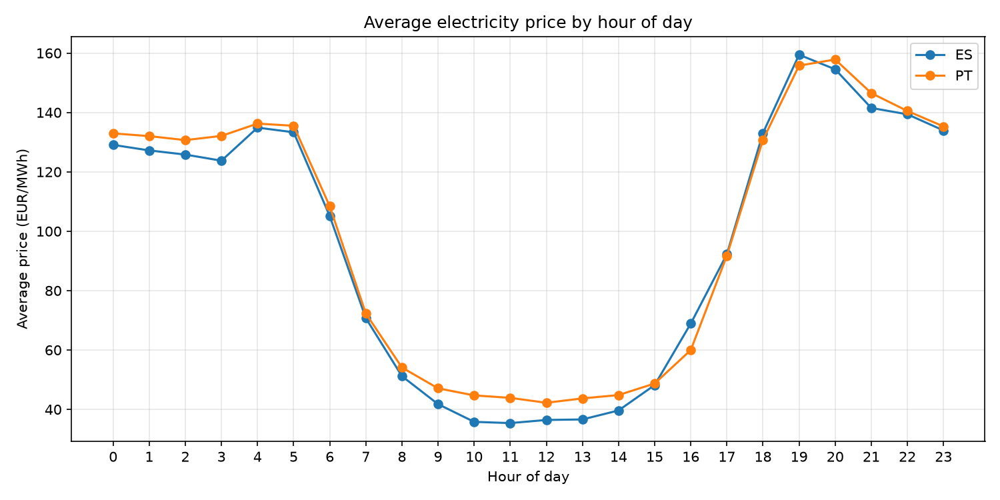
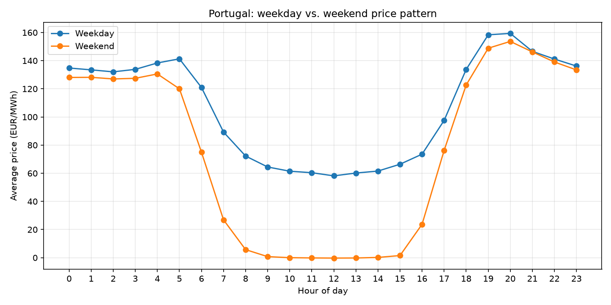

# Electricity Prices Pipeline (PT/ES Day-Ahead Market)

A small data engineering pipeline that pulls day-ahead electricity prices for Portugal and Spain from the ENTSO-E Transparency Platform, parses and deduplicates them, and loads them into Postgres — plus an analysis layer that turns the accumulated history into a handful of concrete market observations.

## What it does

- **Extracts** day-ahead prices (15-minute resolution) for the PT and ES bidding zones from the [ENTSO-E Transparency Platform](https://transparency.entsoe.eu/) API.
- **Parses** the raw XML responses into a tidy, gap-free time series — forward-filling missing points and handling revised `TimeSeries` blocks that ENTSO-E sometimes returns for the same period.
- **Deduplicates** overlapping revisions, keeping the most recently published value per `(bidding_zone, period_start)`.
- **Loads** the result into Postgres via a staging table and an `INSERT ... ON CONFLICT DO UPDATE` upsert, so re-running the pipeline never produces duplicate rows.
- **Runs daily** (last 7 days, to safely cover any late revisions) via Windows Task Scheduler + a `.bat` wrapper, with a one-off `backfill.py` script for pulling a longer history to seed the dataset.
- **Analyzes** the accumulated history for patterns: hourly price curve, weekday vs. weekend behavior, PT–ES market decoupling, price trend, and volatility/outliers.

## Tech stack

- **Python** — `requests`, `pandas`, `xml.etree.ElementTree`
- **PostgreSQL** — [Neon](https://neon.tech) (serverless Postgres) for the live dataset, local Docker Postgres for development
- **SQLAlchemy** + `psycopg2-binary` for the DB layer, `python-dotenv` for config
- **Docker Compose** for a disposable local Postgres instance
- **Matplotlib** for chart generation
- **Windows Task Scheduler** for daily automation

## Project structure

```
energia-precos/
├── scripts/
│   ├── extract_prices.py   # daily pipeline: fetch → parse → dedupe → upsert (last 7 days)
│   ├── backfill.py         # one-off: same pipeline, longer historical window
│   └── analysis.py         # reads from Postgres, prints findings, saves charts
├── charts/                 # PNGs generated by analysis.py
├── docker-compose.yml      # local Postgres for development
├── run_pipeline.bat        # wrapper invoked by Windows Task Scheduler
├── requirements.txt
├── .env.example
└── .gitignore
```

## Architecture

```
ENTSO-E Transparency API  (day-ahead prices, XML — one request per bidding zone)
        │
        ▼
XML parsing (ElementTree) → tidy, gap-filled DataFrame (forward-fill per 15-min interval)
        │
        ▼
Deduplication — keep latest revision per (bidding_zone, period_start)
        │
        ▼
staging_prices table (Postgres, replaced every run)
        │
        │  INSERT ... ON CONFLICT (bidding_zone, period_start) DO UPDATE
        ▼
electricity_prices table (Postgres) — upserted, deduplicated history
        │
        ├──► scripts/analysis.py → pandas analysis + matplotlib charts
        └──► Windows Task Scheduler → run_pipeline.bat → daily automated run
```

## Running it locally

**1. Clone and set up the environment**

```bash
git clone <this-repo-url>
cd energia-precos
python -m venv venv
venv\Scripts\activate        # Windows
pip install -r requirements.txt
```

**2. Configure environment variables**

```bash
cp .env.example .env
```

Fill in `.env` with:
- `ENTSOE_API_KEY` — from the [ENTSO-E Transparency Platform](https://transparency.entsoe.eu/) (Account Settings → Web API Security Token)
- `DB_TARGET` — `local` (Docker Postgres) or `neon` (hosted Postgres)
- `DB_USER` / `DB_PASSWORD` / `DB_HOST` / `DB_PORT` / `DB_NAME` — used for local Postgres, and reused by `docker-compose.yml` to configure the container
- `DATABASE_URL_NEON` — full connection string, only needed if `DB_TARGET=neon`

**3. Start a local Postgres (optional — skip if using Neon)**

```bash
docker compose up -d
```

**4. Run the pipeline**

```bash
python scripts/backfill.py          # one-off: seed history (default: last 21 days)
python scripts/extract_prices.py    # daily incremental run (last 7 days)
python scripts/analysis.py          # print findings + regenerate charts in /charts
```

**5. Automate it (optional)**

`run_pipeline.bat` activates the venv, sets `DB_TARGET=neon`, and runs `extract_prices.py`. Point a Windows Task Scheduler job at it to run daily.

## Findings

Based on ~3 weeks of 15-minute day-ahead data for PT and ES (June–July 2026):

- **Clear hourly pattern.** Prices trough around midday (PT: ~42 EUR/MWh at 12:00, driven by solar generation) and peak in the early evening (PT: ~158 EUR/MWh at 20:00, as solar drops off and demand ramps up) — roughly a 3.7x swing within a single day.
- **Negative prices happen, briefly.** Several days saw the daily minimum dip slightly below zero (e.g. -1.30 EUR/MWh, -0.81 EUR/MWh), consistent with midday oversupply from solar generation outstripping demand.
- **Weekends are meaningfully cheaper.** PT weekend average price is **28.7% lower** than the weekday average (76.45 vs. 107.15 EUR/MWh), reflecting lower industrial demand.
- **PT and ES decouple more often than you'd expect.** Despite being part of the same MIBEL coupled market, 43.2% of intervals showed a significant price gap (>10 EUR/MWh) between the two zones — concentrated on weekdays (49.1% of weekday intervals vs. 27.7% on weekends) and more frequent in the mid-afternoon (16:00–17:00, >60% of intervals), pointing to recurring interconnection congestion rather than random noise.





Full write-up: [LINK]

## License

MIT
